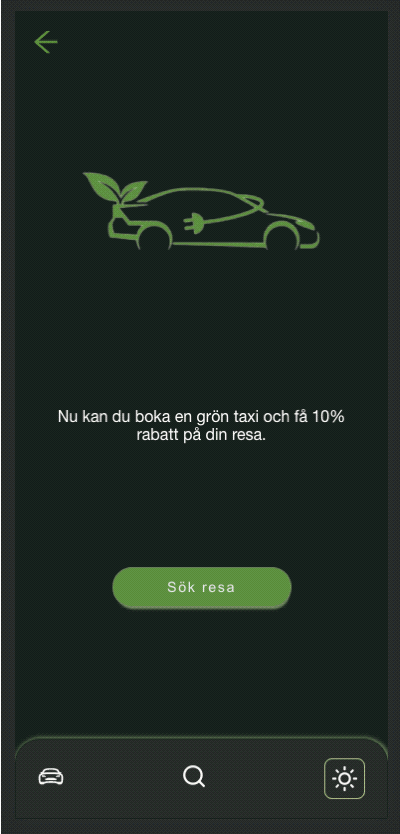

<br />
<p align="center">
  <p>
    
  </p>

  <h1 align="center">Green-Car Sustinable car choices</h1>

</p>
<br />

<details open="open">
  <summary>Table of Contents</summary>
  <ol>
    <li>
      <a href="#about-the-project">About The Project</a>
      <ul>
        <li><a href="#built-with">Built With</a></li>
      </ul>
    </li>
    <li>
      <a href="#getting-started">Getting Started</a>
      <ul>
        <li><a href="#installation">Installation</a></li>
      </ul>
    </li>
    <li><a href="#contact">Contact</a></li>
  </ol>
</details>
----
<br />

## About The Project

<p align="justify">
This application is a schoolproject from KYH Stockholm frontend developer 2020 class. 
We started creating a prototype (mvp) in groups using Figma and implemented the UX design individually. I used React for my building.
</p>
</br>

---

</br>

Figma Prototype - [https://www.figma.com/proto/zoafAjyjN8TGlHJ7hPRVMB/H%C3%A5llbart-Resande-Grupp-4-team-library?page-id=0%3A1&node-id=452%3A225&starting-point-node-id=312%3A6](https://www.figma.com/proto/zoafAjyjN8TGlHJ7hPRVMB/H%C3%A5llbart-Resande-Grupp-4-team-library?page-id=0%3A1&node-id=452%3A225&starting-point-node-id=312%3A6)

</br>

<p align="justify">
The projects nisch was sustainable travelling. So we started with interviews to gather information from potential users. This gave us valuable tips for how to build the prototype into a minimal valuable product. The next step was to have test persons for our project and afterwards do some final touches before the presentation.
</p>
</br>

---

### Built With

- [React]
- [styled-components]
- [React-router-dom]
- [Mapbox]

## Getting Started

To setup this project locally you may follow the installation steps below.

### Installation

1. Update the latest version of your package manager
   ```sh
   npm install npm@latest -g
   ```
2. Clone the repo
   ```sh
   git clone https://github.com/kayzersozee/green-cab.git
   ```
3. Install NPM packages
   ```sh
   npm install
   ```

## Contact

**Author**

- [Nikolas Rosinelli](https://github.com/kayzersozee)

Project Link: [https://github.com/kayzersozee/green-cab](https://github.com/kayzersozee/green-cab)

Demo - [https://green-cab.surge.sh/](https://green-cab.surge.sh/)
